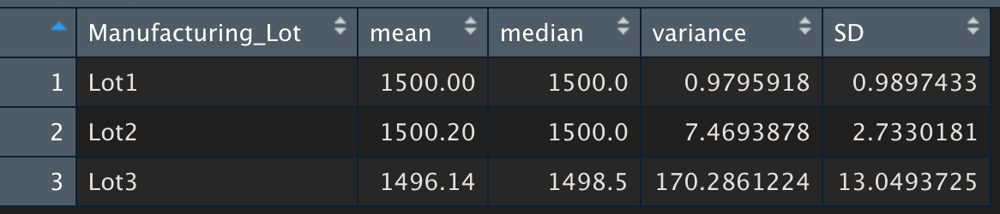

# MechaCar Statistical Analysis

A few weeks after starting his new role, Jeremy is approached by upper management about a special project. AutosRUs’ newest prototype, the MechaCar, is suffering from production troubles that are blocking the manufacturing team’s progress. AutosRUs’ upper management has called on Jeremy and the data analytics team to review the production data for insights that may help the manufacturing team.

In this challenge, you’ll help Jeremy and the data analytics team do the following:

- Perform multiple linear regression analysis to identify which variables in the dataset predict the mpg of MechaCar prototypes
- Collect summary statistics on the pounds per square inch (PSI) of the suspension coils from the manufacturing lots
- Run t-tests to determine if the manufacturing lots are statistically different from the mean population
- Design a statistical study to compare vehicle performance of the MechaCar vehicles against vehicles from other manufacturers. For each statistical analysis, you’ll write a summary interpretation of the findings.

## Linear Regression to Predict MPG

By running the linear regression model to predict MPG, we can find the results below:

With that, we can have some conslusions about the model:
- The vehicle weight, spoiler angle and AWD had p-values higher than 0.05, which means they randomly  influenced the model.
- The variables vehicle_length and ground_clearance had very low individual p-values (5.08e-08 and 5.21e-08), and that indicates that they had a direct influence in the whole model, which has a general p-value of 5.35e-11.
- The slope is not zero, as the regression p-value is 5.35e-11, which portrays that the dependent variables had non-random influence in the dependent variable.
- The r-squared value is 0.7149, which means that approximately 71% of the mpg predictions can be effectively predicted by this model.

## Summary Statistics on Suspension Coils

As the design specifications for the MechaCar suspension coils dictate that the variance of the suspension coils must not exceed 100 pounds per square inch, let's determine the variance among the all the prototypes and by lot to validate whether this spec is met.

We can see above that the general variance is 62.29, which is according to the specifications. Let's analyze the information by lot:

When we look individually each lot, we can see that the variance in lots 1 and 2 are way below 100 psi, which means these prorotypes meet the requirements, but the ones in Lot 3, which has a variance of 173, does not.

## T-Tests on Suspension Coils.

In the last part of this analysis, I will perform t-tests to determine if all manufacturing lots and each lot individually are statistically different from the population mean of 1,500 pounds per square inch.

Looking into the results across all manufacturing lots shows the prototypes are not statistically different from the population mean. The p-value is 0.06, which is higher 0.05, so there is not enough evidence to reject the null hypothesis. Now let's look into individual lots:

Looking into the lots individually, we can see that lots 1 and 2 are not statistically different from the whole lot, as the p-values are not lower than 0.05. When we look into lot 3, though, this lot is low enough for us to reject the null hyphotesis, with a p-value of 0.04168.

## Study Design: MechaCar vs Competition.

This study involves analyzing car variables to determine how they influence the MechaCar maintenance cost and trying to determine if they are priced according to the market.

The maintenance cost is the dependent variables while the independent variables would be the seling price, acceleration, MPG, horse power, engine type, top speed and payload.

- Null Hyphothesys: The MechaCar prototypes maintenance cost are priced according to the market and the competition, with at least 20% of variance when compared to other models.

- Alternative Hyphothesys: The MechaCar prototypes maintenance cost is not priced according to the market and the competition.

For the study, a multiple linear regression would be used to determine what variables have or not correlation with the maintenance price, and we would predict a mnaintenance price if the variables are correlated.